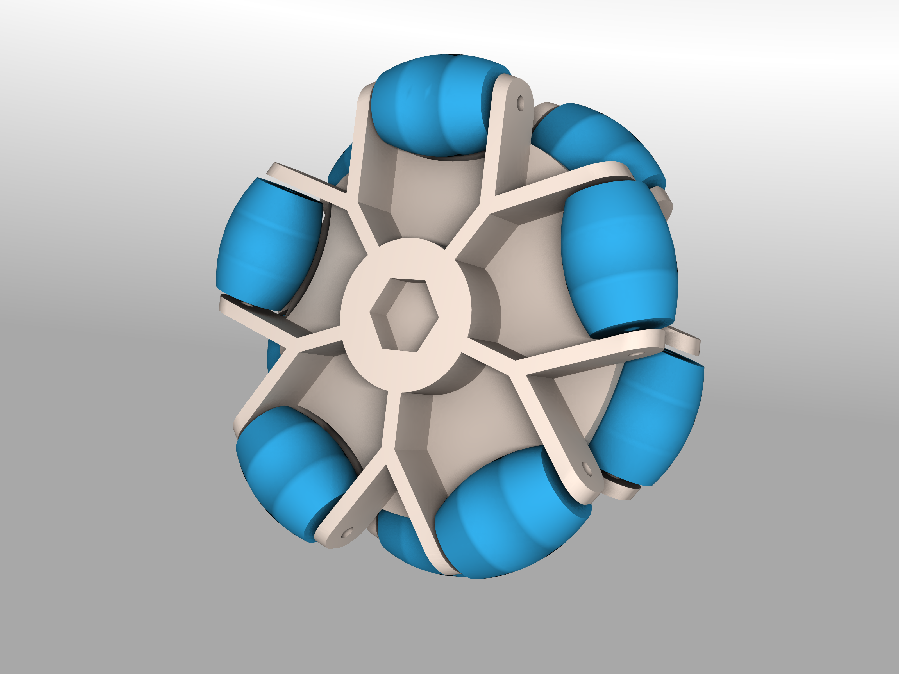

# FreeCAD-Omniwheel
Modelo en FreeCAD capaz de generar ruedas tipo omniwheel.
--------

Description
--------
Parametric model designed in FreeCAD to facilitate the design of omniwheel type wheels. It uses the Spreadsheet workbench for the reference of variables and calculation of parameters used in the model. Some parameters that can be edited: 
* Number of 'wheels' 
* Wheel diameters 
* Tolerance (extra space between the wheels and the bracket) 
* Thickness of the bracket

**Requiere Freecad 0.16 o superior**
Autor
-----
Gustavo Segura(gsegura96). Jul-2016

Licencia
-----

